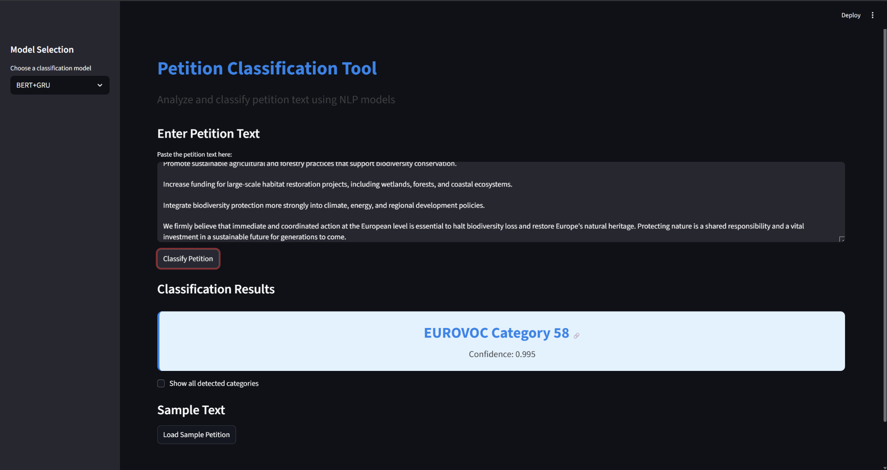

# 📝 Multi‑Label Petition Classification Application

An end‑to‑end **Natural Language Processing (NLP)** application that classifies **European Union petition texts** into relevant **EUROVOC categories** using both **traditional machine learning** and **deep learning** models.  
The project also includes a fully interactive **Streamlit web application** for real‑time classification and comparison across models.

---

## 🔍 Project Overview

- **Task:** Multi‑label classification of EU petitions  
- **Dataset:** EURLEX (LexGLUE benchmark) from HuggingFace  
- **Labels:** EUROVOC concept categories  
- **Models:** TF‑IDF + ML models and BERT‑based DL models  
- **Deployment:** Streamlit Web Application  
- **Objective:** Compare model performance and demonstrate real‑time legal text classification  

Each petition can belong to **multiple EUROVOC categories**, making this a challenging and realistic multi‑label NLP task.

---

## 📊 Models Implemented

| Model | Description |
|------|-------------|
| **TF‑IDF + Naive Bayes** | Probabilistic baseline classifier |
| **TF‑IDF + Passive Aggressive** | Strong linear classifier for large‑scale text |
| **BERT + GRU** | Contextual embeddings with sequential modeling |
| **BERT + BiLSTM** | Bidirectional sequence modeling over BERT embeddings |

---

## 📈 Final Model Performance (EURLEX Dataset)

| Model | F1 Score | Precision | Recall |
|-----|---------|-----------|--------|
| TF‑IDF + Naive Bayes | 0.5566 | 0.7725 | 0.4350 |
| TF‑IDF + Passive Aggressive | 0.7536 | 0.7821 | 0.7272 |
| **BERT + GRU** | **0.7585** | **0.8549** | **0.6817** |
| BERT + BiLSTM | 0.7238 | 0.8590 | 0.6254 |

**Best overall model:** **BERT + GRU**, achieving the highest F1 score with strong precision–recall balance.

---

## 🖥️ Streamlit Application Features

- 🔄 Model selection from sidebar  
- ✍️ Custom petition text input  
- 📊 Confidence‑based prediction display  
- 🔗 Clickable EUROVOC category links  
- 🧪 Sample petition loader  
- 🌙 Clean, professional dark‑mode UI  

---

## 📸 Application Preview
---

---

📦 Model Files (Important)

GitHub does not store large model files.
Before running the Streamlit application, ensure the following files are present in the project root directory:

tfidf_vectorizer.pkl
multilabel_binarizer.pkl
naive_bayes_model.pkl
passive_aggressive_model.pkl
bert_gru_model.pt
bert_bilstm_model.pt

---

🧠 Exporting Models from the Notebook:

# Save TF-IDF vectorizer
joblib.dump(tfidf, "tfidf_vectorizer.pkl")

# Save MultiLabelBinarizer
joblib.dump(mlb, "multilabel_binarizer.pkl")

# Save traditional ML models
joblib.dump(model_nb, "naive_bayes_model.pkl")
joblib.dump(model_pa, "passive_aggressive_model.pkl")

# Save deep learning models
torch.save(model_bert_gru, "bert_gru_model.pt")
torch.save(model_bilstm, "bert_bilstm_model.pt")

---

▶️ Running the Application
streamlit run streamlit-app.py

Open in browser:http://localhost:8501

---

NLP_FINAL_PROJECT/
├── codebase.ipynb
├── streamlit-app.py
├── requirements.txt
├── *.pkl / *.pt
├── README.md
└── screenshots/

---
🌐 EUROVOC Integration

Each predicted label links directly to the official EUROVOC concept page:

https://op.europa.eu/en/web/eu-vocabularies/eurovoc

This allows users to explore the semantic meaning of each predicted category.

---
👤 Author

Umar Javeed Altaf
Graduate Student – Artificial Intelligence
Northeastern University

---
